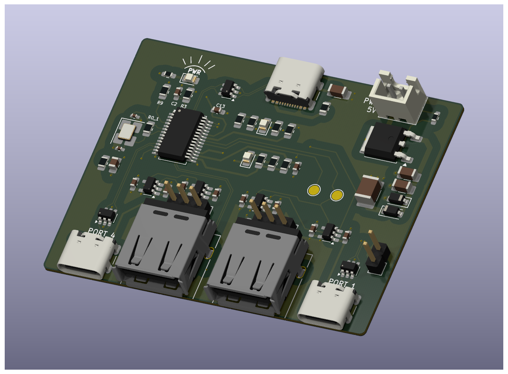
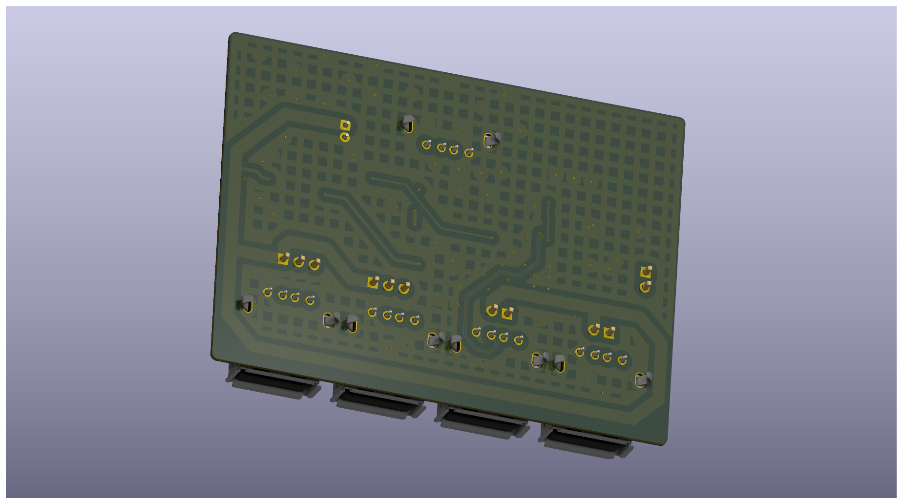

Board made primarily for evaluation of the GL852G IC that was at the time being considered for a larger PCB design.
Contains one High-Speed upstream port and four independent downstream HS/FS ports with MTT.

Designed for easy hand assembly, with only two 0402 capacitors for crystal. All bootstrapping and IO pins are easily accessible on the board.

Components are only placed on top layer.

